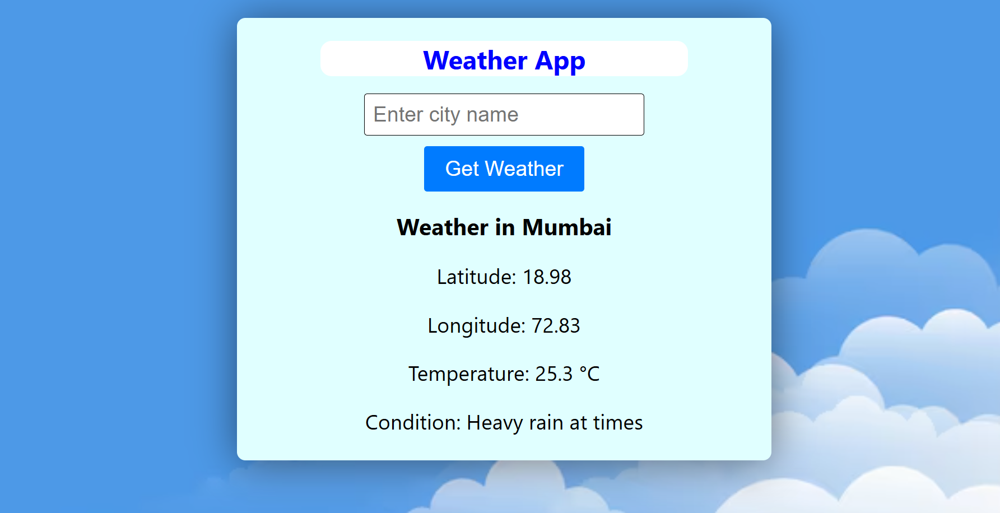

# Weather App using React.js



## Table of Contents

- [Description](#description)
- [Demo](#demo)
- [Features](#features)
- [Installation](#installation)
- [Usage](#usage)
- [Technologies Used](#technologies-used)
- [Contributing](#contributing)
- [License](#license)

## Description

A weather application built with React.js that allows users to check the current weather conditions for a specified city. The application fetches data from the WeatherAPI.com and displays the temperature, weather condition, and other relevant information.

## Features

- Enter a city name to fetch current weather data.
- Display temperature in Celsius or Fahrenheit.
- Show weather conditions such as sunny, cloudy, rainy, etc.
- Responsive design for desktop and mobile devices.

## Installation

To run this project locally, follow these steps:

1. Clone the repository:

   ```bash
   git clone https://github.com/Athrvvv/Weather-App-using-react.js.git
   
2. Navigate into the project directory:

   ```bash
   cd Weather-App-using-react.js
   
3. Install dependencies:

   ```bash
   npm install

4. Start the development server:

   ```bash
   npm start

5. Open http://localhost:3000 in your browser to view the app.

## Usage

- Enter a city name in the input field and press Enter or click the search button.
- The app will fetch and display the current weather information for the specified city.

## Technologies Used
 - React.js
 - HTML/CSS
 - JavaScript (ES6+)
 - WeatherAPI.com for weather data

## Contributing

Contributions are welcome! Feel free to fork the repository and submit pull requests to propose improvements or new features.

## License

This project is licensed under the MIT License. See the LICENSE file for more details.

